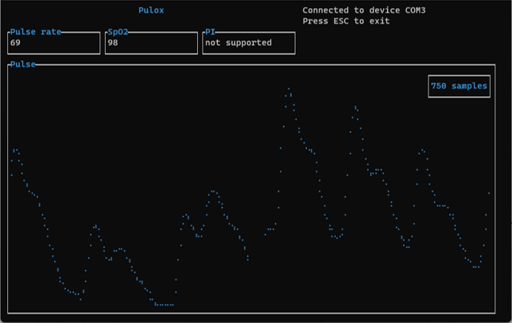

# pulox

Rust application to interact with pulox pulse oximeters

Build command: `cargo build`

## Overview

```
Interact with Pulox PPG

USAGE:
    pulox.exe [PORT] <SUBCOMMAND>

ARGS:
    <PORT>    Name of serial port [default: COM3]

OPTIONS:
    -h, --help       Print help information
    -V, --version    Print version information

SUBCOMMANDS:
    clear-storage    Delete storage data segment
    help             Print this message or the help of the given subcommand(s)
    realtime         Read real time data
    storage          Read storage data
    sync-time        Sync device time
```

Argument `port` specifies to which serial port the device is connected.  
This defaults to `COM3`, which is typically the name of the serial port on windows. 

## Subcommands

#### realtime
````
Read real time data

USAGE:
    pulox.exe realtime [OPTIONS]

OPTIONS:
    -f, --format <FORMAT>    Output format [possible values: csv]
    -h, --help               Print help information
        --no-console         Show no output in console
    -o, --output <OUTPUT>    Output File
````



The rich user interface can be disabled using the `--no-console` flag. In this case, only a counter of received measurements will be shown. 

To record the data to a file, specify both the output format (`--format`) and the output file (`--output`). 

#### storage
````
Read storage data

USAGE:
    pulox.exe storage --format <FORMAT> --output <OUTPUT>

OPTIONS:
    -f, --format <FORMAT>    Output format [possible values: csv]
    -h, --help               Print help information
    -o, --output <OUTPUT>    Output File
````

Reads data from the storage on the device. 
If the device supports multiple users or storage segment, you will be asked which one you are interested in.

You must specify an output format and file. 

#### clear-storage

_Not supported by PULOX PO-250_

Delete a single storage segment on the device.  
If the device supports multiple users or storage segment, you will be asked which one you want to delete.

#### sync-time

_Not supported by PULOX PO-250_

Sets the device time to the current time of the host PC.
